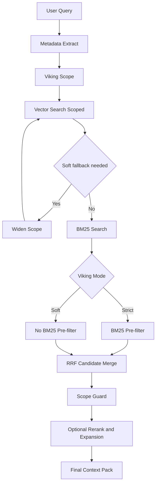
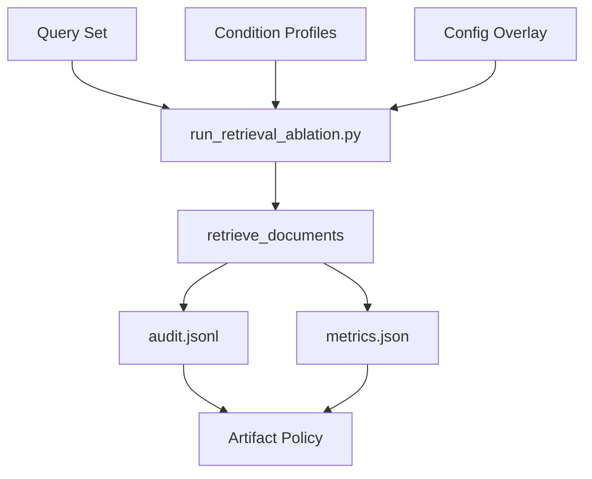

# LTDB Advanced RAG System

LTDB 기반 RAG 시스템.

**data/**에 *HTML 자료*를 내장하고 있다고 가정함. 형식은 LTDB Database([소수 민족 언어 유형 데이터베이스](http://www.typologydb.org/wiki/))를 따름.

Major portion of this repo code generated by AI.

## 시스템 다이어그램

### A. UI/LangGraph + Viking Retrieval 파이프라인



- `RRF Fusion`은 **최종 top-k 결정 단계가 아닌**, 벡터/BM25 **후보 결합 단계**
- BM25 pre-filter는 **strict mode에서만** 적용
- soft mode는 BM25를 fusion에 넣고 제어는 post-fusion `Viking Scope Guard`에서 수행

### B. Retriever-core Ablation Harness



- harness는 `retrieve_documents()` 중심 경로만 사용.
- UI(`src/ui/graph_web.py`) / LangGraph runtime import에 의존하지 않는 retriever-core 평가용 경로

## UV 기반 실행 방법

### 1) 환경 준비

```bash
uv venv
uv sync
```

필요시(vision 경로 사용 시 1회):

```bash
uv run playwright install
```

### 2) 실행

UI 실행 (port 고정):

```bash
uv run streamlit run src/ui/graph_web.py --server.port 8501
```

샘플 질의:

```text
Takpa어의 부정에 대해 예문을 들어 설명하세요.
```

Harness 실행(planned):

```bash
uv run -m src.eval.run_retrieval_ablation \
  --queries src/eval/sample_queries.jsonl \
  --conditions baseline,viking_soft \
  --out-dir results/ablation_verify_20260213_cto
```

## Viking 정책(임시)

Soft fallback policy v1.1:
- Trigger:
  - `mode=soft`
  - `vector_hits < min_hits`
  - `attempts < max_expansions`
- Step chain:
  - `phenomenon -> category -> lang-only -> unrestricted`
- BM25 policy:
  - `strict`: BM25 pre-filter ON
  - `soft`: BM25 pre-filter OFF, fusion 이후 scope guard 적용

로그 필드(fixed):
- `attempt/max`
- `trigger reason`
- `fallback level`
- `step name`
- `pattern count`
- `min_hits`
- `max_expansions`

## 하네스/아티팩트 정책(임시)

하네스 decoupling 원칙:
- `src/eval/run_retrieval_ablation.py`는 retriever-core 호출만 수행
- UI/graph import 경로를 섞지 않는다.
- 조건별 config override는 로컬로 적용하고 복구

아티팩트 정책:
- Git에는 작은 결과만 포함:
  - `metrics.json`, manifest, 설정 스냅샷
- 대용량 로그/중간 산출물은 백업 경로로 보관:
  - `~/backupRAG/<run_id>/`
  - 또는 `results/`를 gitignore로 관리

## Troubleshooting

### 1) Strict 모드에서 0 docs

대응:
1. UI에서 `Viking Soft Fallback` 활성화
2. `Viking Max Expansions` 증가
3. `retrieval.viking.min_hits` 조정

UI는 strict에서 0 docs가 나오면 경고를 표시하도록 의도됨.

### 2) `BM25 filtered to 0 by Viking strict`

의미:
- strict 스코프에서 BM25 후보가 모두 제거됨
- 이 경우 vector-only 경로로 진행할 수 있다

### 3) Soft fallback 과도/부족

- fallback이 너무 자주 발생하면 `min_hits`++
- fallback 확장이 부족하면 `max_expansions`++
